# ☁️ CloudMart – AWS Scalable E-Commerce Web Application

CloudMart is a scalable e-commerce web application deployed on Amazon Web Services (AWS). The project demonstrates how a traditional PHP/MySQL application can be migrated to a highly available cloud architecture using core AWS services.

Instead of storing product images locally, CloudMart stores them securely in Amazon S3 while application data is stored in Amazon RDS. The application is hosted on Amazon EC2 behind an Application Load Balancer and Auto Scaling Group to improve availability and scalability.

This project was built as a practical cloud deployment project.

---

## Quick Info

<h3>CloudMart:</h3>

A highly available cloud-based e-commerce web application deployed on Amazon Web Services (AWS).

-  Backend: PHP 
-  Frontend: HTML, CSS 
-  Database: Amazon RDS (MySQL) 
-  Cloud Storage: Amazon S3 (Product Images) 
-  Hosting: Amazon EC2 
-  Networking: Amazon VPC 
-  High Availability: Application Load Balancer + Auto Scaling Group 
-  Server Management: AWS Systems Manager (SSM) 
-  Image Upload: AWS SDK for PHP 
-  User Roles: Admin & Customer 
-  Admin Features: Manage Products, Categories and Orders 
-  Security: Password Hashing, Session Authentication, IAM Role

---

## Project Highlights

- Designed and deployed a highly available e-commerce application on AWS.
- Implemented Auto Scaling and Application Load Balancer for scalability and fault tolerance.
- Stored product images securely in Amazon S3 using IAM Roles (no AWS access keys).
- Hosted application on Amazon EC2 with Apache and PHP.
- Configured Amazon RDS MySQL for persistent cloud database storage.
- Managed EC2 instances securely using AWS Systems Manager (SSM).
- Built custom networking using Amazon VPC, Public Subnets, Internet Gateway, Route Tables, and Security Groups.

---

## Features

- User Registration & Login
- Admin Dashboard
- Product Management
- Category Management
- Shopping Cart
- Order Management
- Product Images stored in Amazon S3
- Database hosted on Amazon RDS
- Highly Available Deployment
- Auto Scaling
- Load Balancing
- IAM Role Authentication (No AWS Access Keys)

---

## AWS Services Used

| Service | Purpose |
|----------|----------|
| Amazon VPC | Custom network |
| Public Subnets | Multi-AZ deployment |
| Internet Gateway | Internet connectivity |
| Security Groups | Firewall |
| Amazon EC2 | Application Hosting |
| IAM Role | Secure AWS Access |
| Amazon S3 | Product Image Storage |
| Amazon RDS MySQL | Database |
| AMI | Reusable Server Image |
| Launch Template | EC2 Configuration |
| Auto Scaling Group | Automatic Scaling |
| Application Load Balancer | Traffic Distribution |
| Target Group | Health Checks |

---

## Architecture Diagram

---

## Architecture Explanation

The application follows a highly available AWS architecture.

1. Users access CloudMart through the Application Load Balancer.

2. The Application Load Balancer distributes incoming HTTP requests to the Target Group.

3. The Target Group forwards healthy requests to EC2 instances running inside an Auto Scaling Group.

4. Auto Scaling launches EC2 instances using a Launch Template created from a custom Amazon Machine Image (AMI).

5. The EC2 instances run Apache, PHP and the CloudMart application.

6. Product information, user accounts and customer orders are stored in Amazon RDS MySQL.

7. Product images are uploaded directly to Amazon S3 using the AWS SDK for PHP.

8. EC2 securely communicates with Amazon S3 through an IAM Role without storing AWS access keys.

9. AWS Systems Manager (SSM) is used for secure server management without SSH.

---

## Screenshots

### Amazon VPC

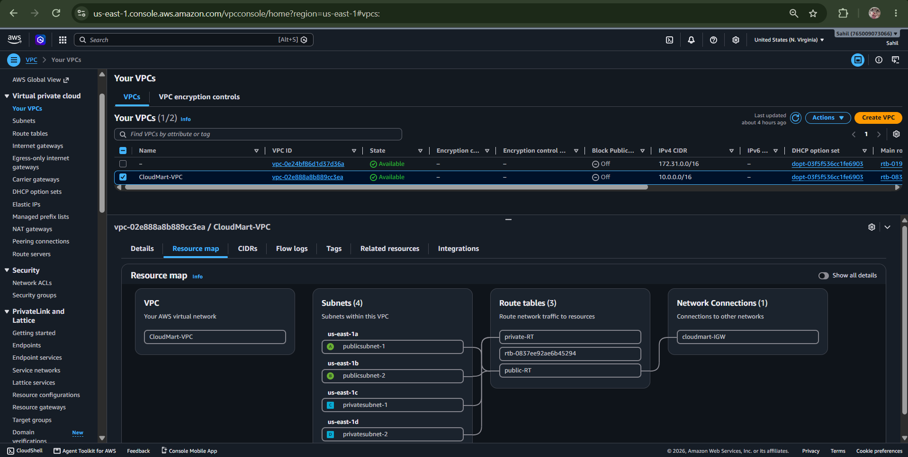
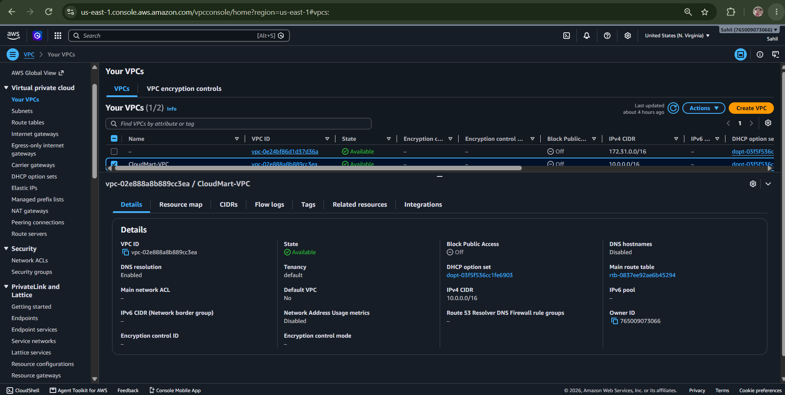
---

### Amazon EC2

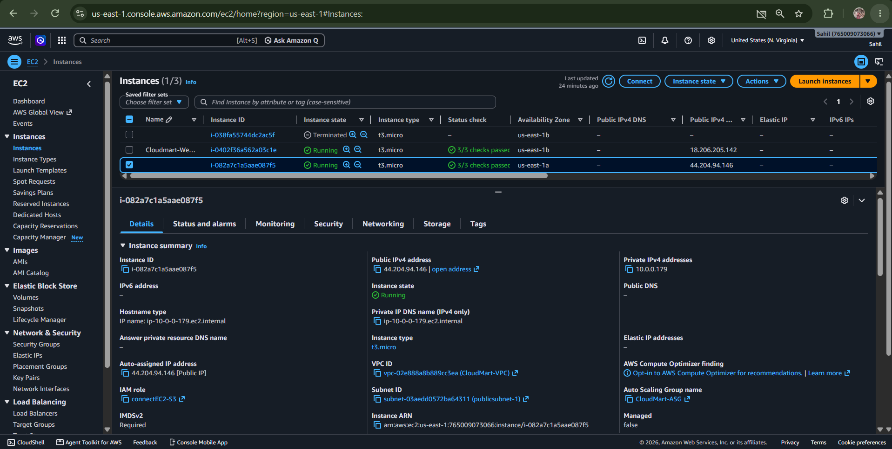
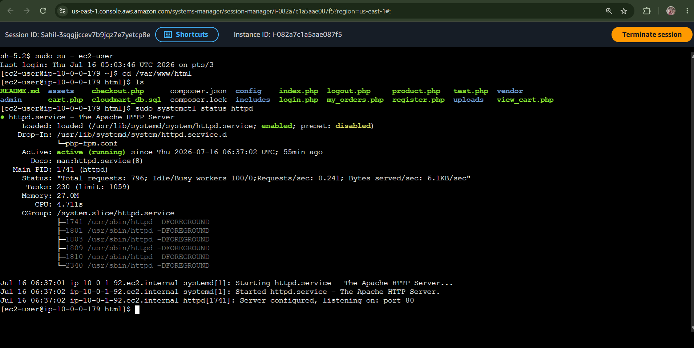
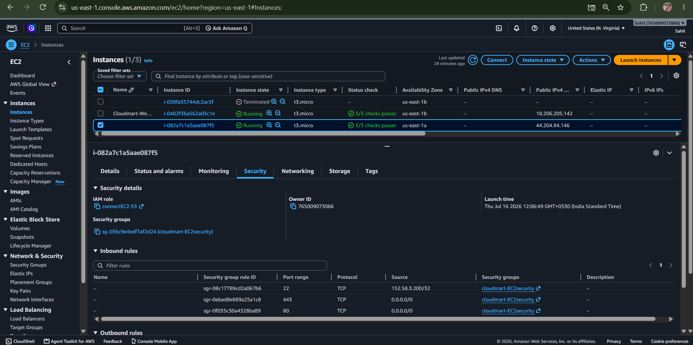

---

### Amazon RDS

---

### Amazon S3

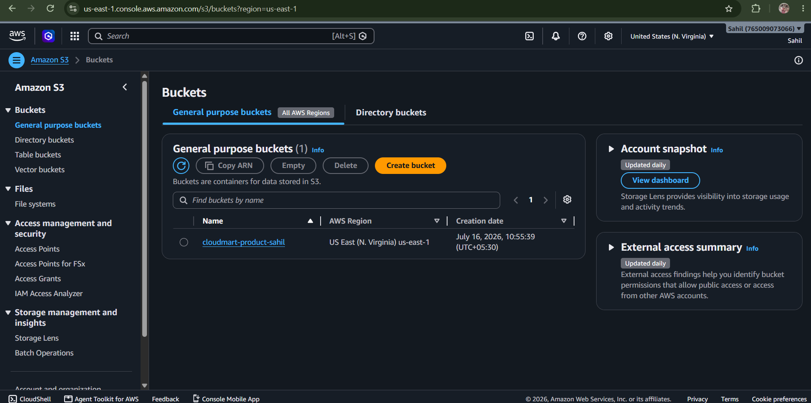

---

### IAM Role

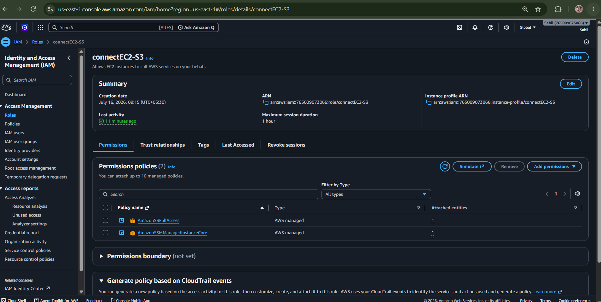

---

### Launch Template

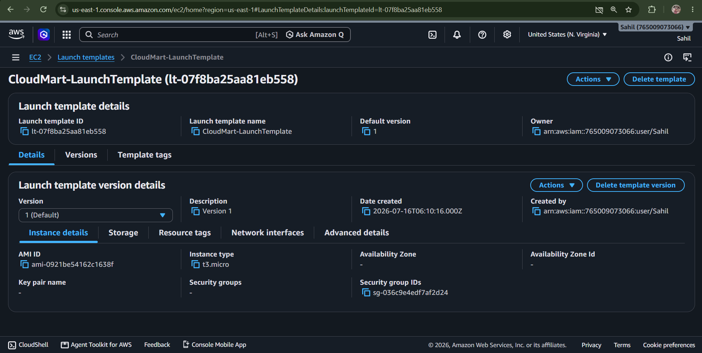

---
    
### Target Group

---

### Application Load Balancer

---

### Auto Scaling Group

---

### Database Overview

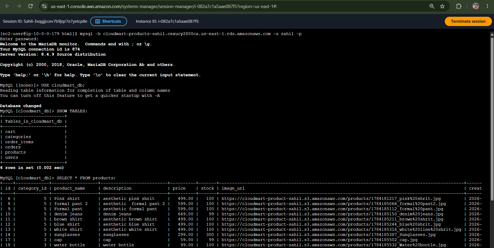

---

### Website

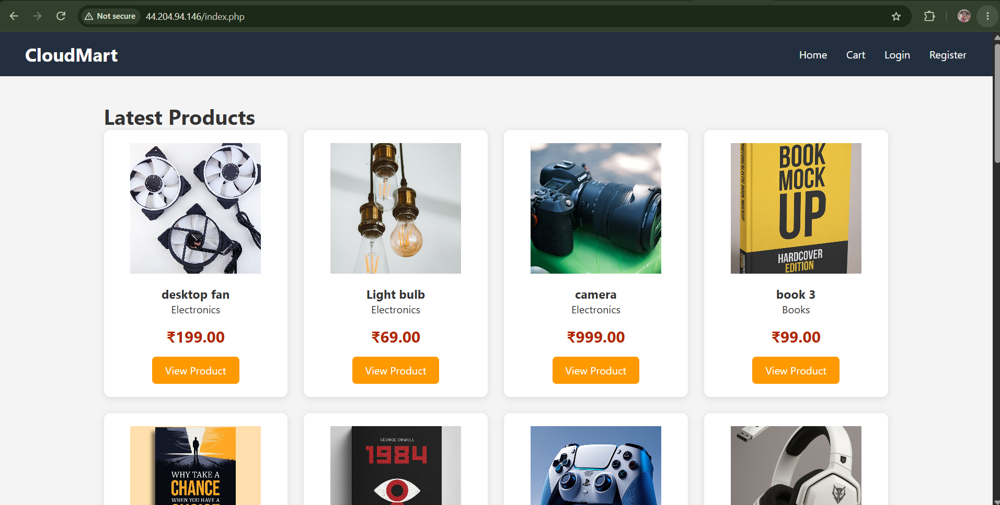
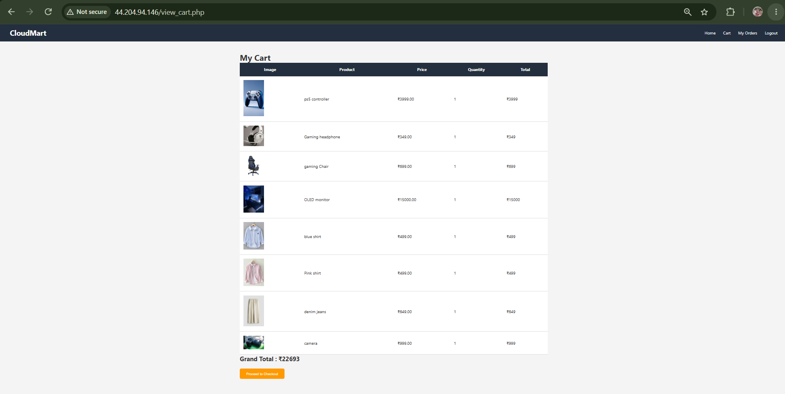
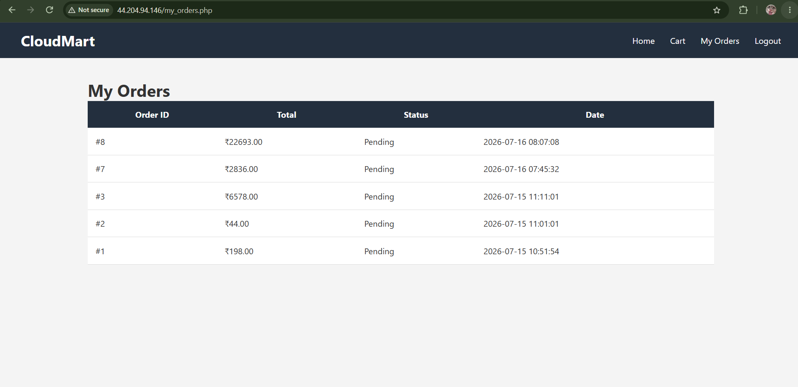
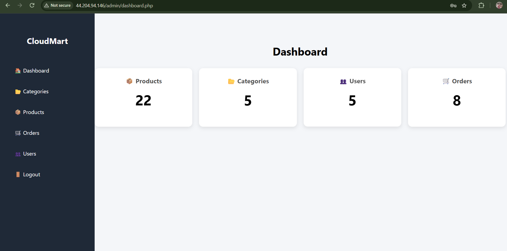
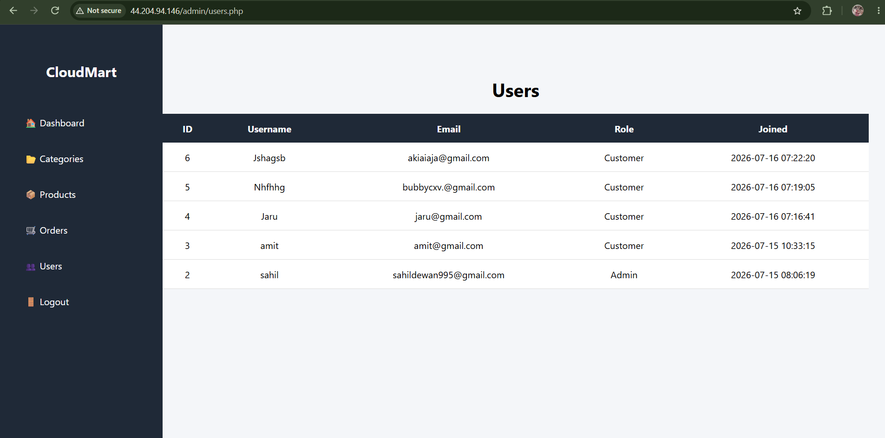
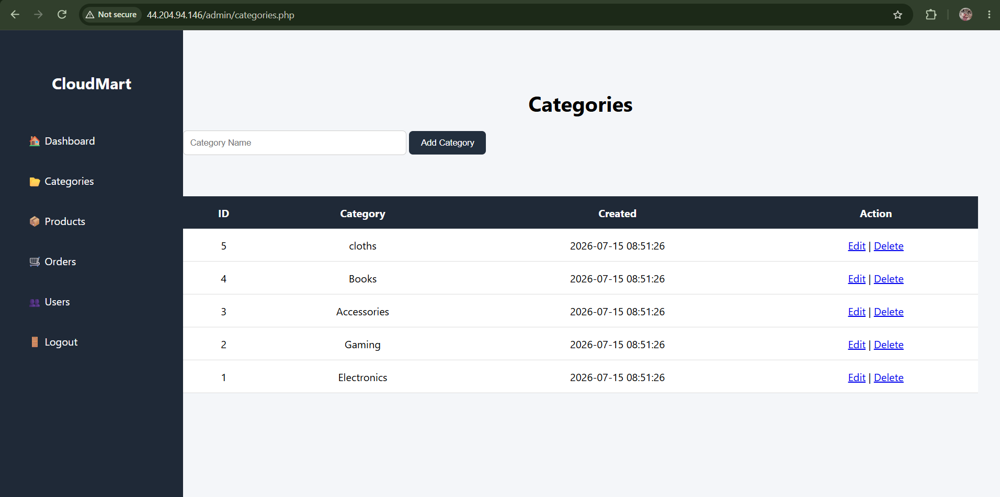

---

## AWS Architecture Components

- Amazon VPC

- Public Subnets

- Internet Gateway

- Route Tables

- Security Groups

- Application Load Balancer

- Target Group

- Auto Scaling Group

- Launch Template

- Amazon Machine Image

- Amazon EC2

- Apache

- PHP

- Amazon RDS

- Amazon S3

- IAM Role

- AWS Systems Manager

---

## Technologies Used

### Frontend
- HTML
- CSS
- JavaScript

### Backend
- PHP

### Database
- MySQL (Amazon RDS)

### Cloud Services
- Amazon EC2
- Amazon RDS
- Amazon S3
- Amazon VPC
- IAM Role
- AWS Systems Manager (SSM)
- Amazon Machine Image (AMI)
- Launch Template
- Target Group
- Application Load Balancer (ALB)
- Auto Scaling Group

### Development Tools
- Visual Studio Code
- Git
- GitHub
- Amazon Linux 2023
- Apache HTTP Server
- Composer
- AWS SDK for PHP
- MySQL CLI

---

## Learning Outcomes

- Deploying scalable PHP applications on Amazon EC2

- Designing highly available architectures using Application Load Balancer and Auto Scaling

- Configuring Amazon RDS MySQL databases

- Storing application assets in Amazon S3

- Managing EC2 instances securely using AWS Systems Manager

- Implementing IAM Roles for secure AWS service communication

- Creating reusable EC2 deployments using Amazon Machine Images

- Using Launch Templates with Auto Scaling Groups

- Configuring Target Groups and Load Balancers

- Designing custom VPC networking

- Managing Linux servers using Bash

- Deploying cloud-native web applications on AWS

---

## Author

**Sahil Dewan**

B.Sc. Information Technology

Aspiring AWS Solutions Architect

Built using AWS Free Tier for hands-on cloud learning.